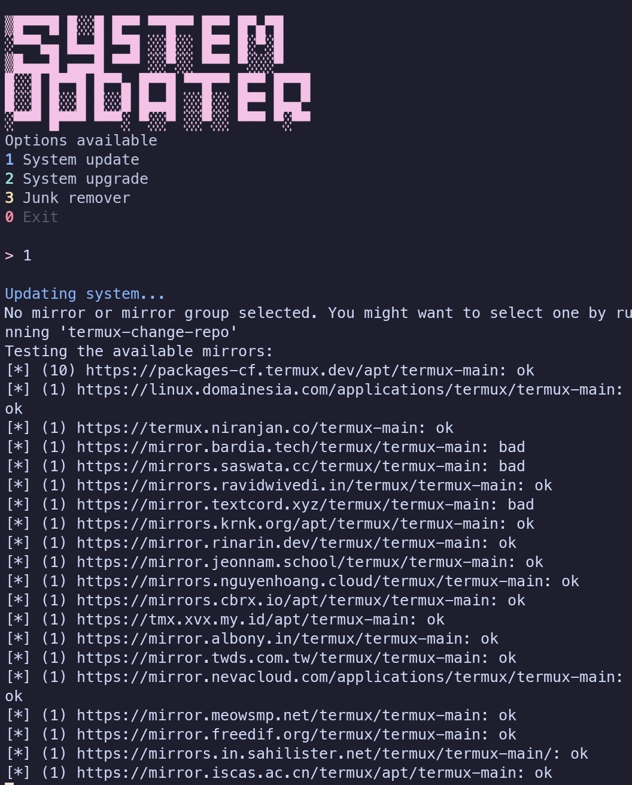

# SystemUpdater (Termux Rust Updater)

A fast and minimal system updater for **Termux**, written in Rust.  
Simple CLI tool to update, upgrade, and clean your Termux environment with a clean UI and zero clutter.

## ✨ Features
- System update (`pkg update`)
- System upgrade (`pkg upgrade`)
- Junk remover (`pkg autoremove` + `pkg clean`)
- Colored terminal UI
- Fast execution using Rust
- Minimal and beginner-friendly code

## 🖥️ Preview
 
## ⚙️ Installation

Clone the repo:
```bash
git clone https://github.com/Azure-6-lgtm/Systemupdater.git
cd Systemupdater
```
Build:
```bash
cargo build --release
```
Run:
```bash
./target/release/updater
```
Or move binary globally:
```bash
mv target/release/updater $PREFIX/bin/
updater
```
## 📦 Requirements
- Termux  
- Rust (`pkg install rust`)  
- Internet connection for updates  

## 🛠️ Built With
- Rust  
- duct crate (for running system commands)  

## 🎯 Goal
To create a fast, clean, and user-friendly updater for Termux using Rust for lazy people.For lazy people by a lazy people.  

## 📄 License
MIT License  

## 👤 Author
**Azure-6-lgtm**  
https://github.com/Azure-6-lgtm

